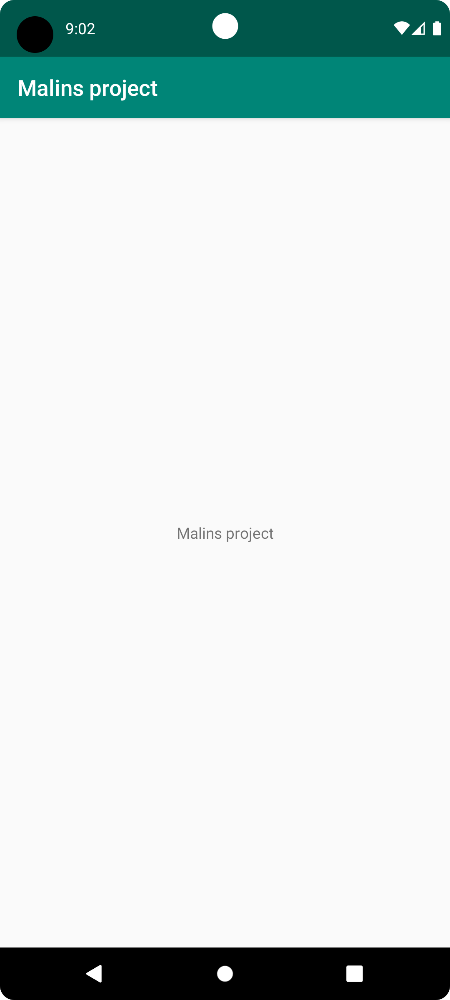

# Rapport

Först skapade jag ett github konto med användarnamnn a21malfo.
Sedan installerade jag Android Studio, som är ett IDE verktyg och skapade en device i Android Studio.
Därefter forkade jag ett projekt. Forking - dvs ett projekt som någon annan lagt ut på GitHub och som man själv vill bygga vidare på. Jag "forkar" projektet och fick då en kopia av alla filer.
Sen gick jag in i projekten och i textfilen strings.xml där ändrade jag texten "Hello" till "Malins project" och sparade.
Sen skapade jag "commit" till mina ändringar i textfilen strings.xml samt "pushade" till github. 
Efter det tog jag en screen capture på min device och kopierade namnet till bilden och lade in den här i rapporten, se figur 1. 
Återigen sparade, skapade commit och pushade till github. Därefter var jag klar.


## Den programkod som ändrades: 

```
<resources>
    <string name="app_name">Malins project</string>
</resources>

```



*Figur 1 (Device)*

