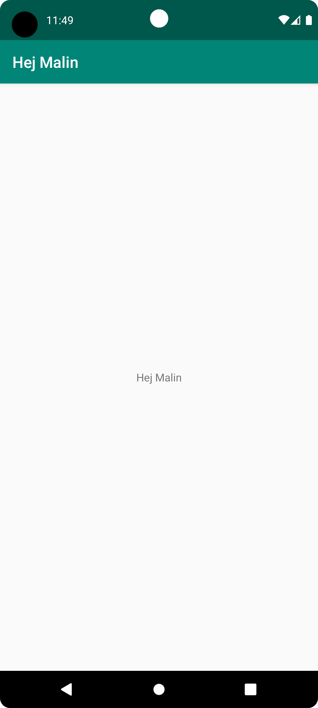

# Rapport

Först skapade jag ett github konto med användarnamnn a21malfo.
Sedan installerade jag Android Studio, som är ett IDE verktyg och skapade en device i Android Studio.
Därefter forkade jag ett projekt. Forking - dvs ett projekt som någon annan lagt ut på GitHub och som man själv vill bygga vidare på. Jag "forkar" projektet och fick då en kopia av alla filer.
Sen gick jag in i projekten och i textfilen strings.xml ändrade jag texten "Hello" till "Hej Malin" och sparade.
Sen skapade jag "commit" till mina ändringar i textfilen strings.xml samt "pushade" till github. 
Efter det tog jag en screen capture på min device och kopierade namnet till bilden och lade in den här i rapporten


## Följande grundsyn gäller dugga-svar:

- Ett kortfattat svar är att föredra. Svar som är längre än en sida text (skärmdumpar och programkod exkluderat) är onödigt långt.
- Svaret skall ha minst en snutt programkod.
- Svaret skall inkludera en kort övergripande förklarande text som redogör för vad respektive snutt programkod gör eller som svarar på annan teorifråga.
- Svaret skall ha minst en skärmdump. Skärmdumpar skall illustrera exekvering av relevant programkod. Eventuell text i skärmdumpar måste vara läsbar.
- I de fall detta efterfrågas, dela upp delar av ditt svar i för- och nackdelar. Dina för- respektive nackdelar skall vara i form av punktlistor med kortare stycken (3-4 meningar).

Den programkod som ändrades: 

```
<resources>
    <string name="app_name">Malins project</string>
</resources>

```



## Figur 1 (Device)

